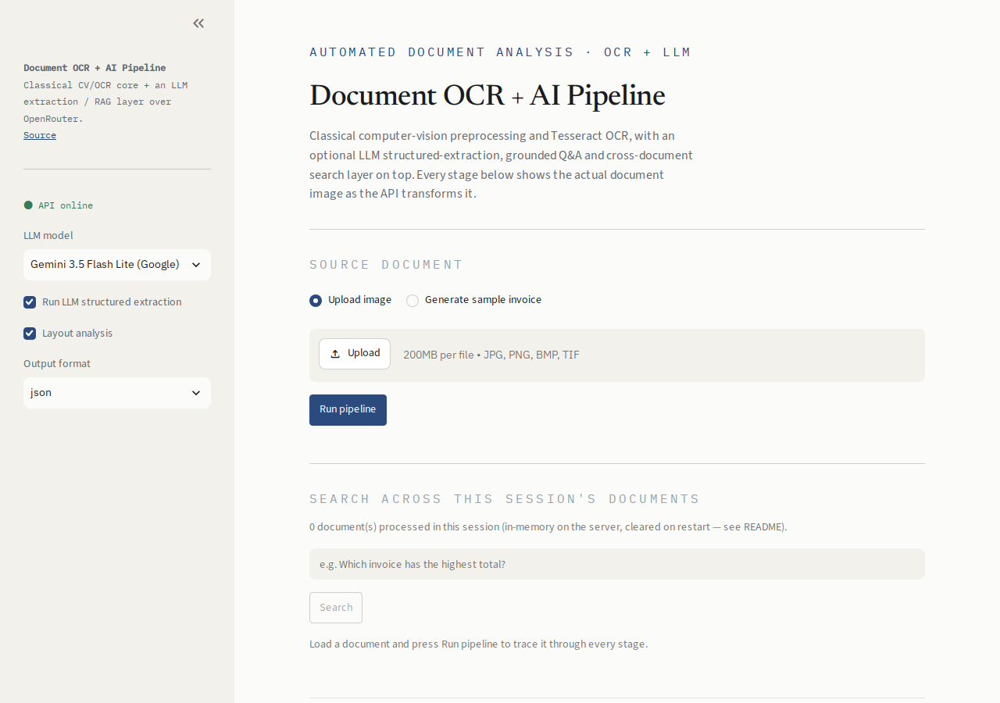
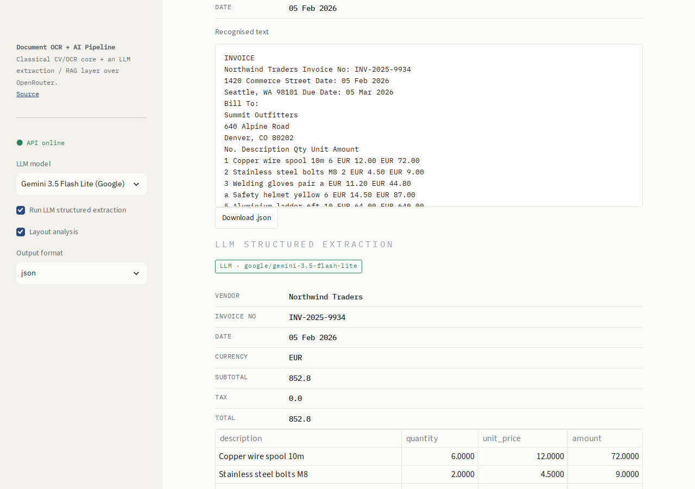
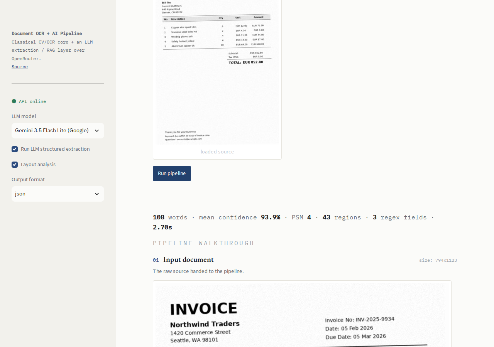
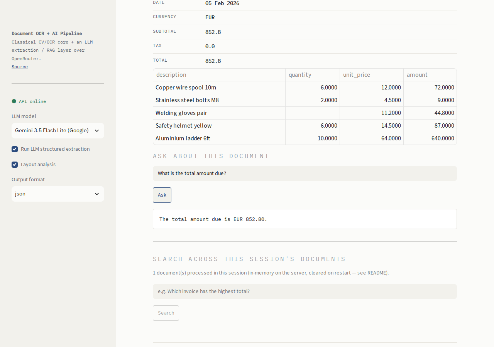
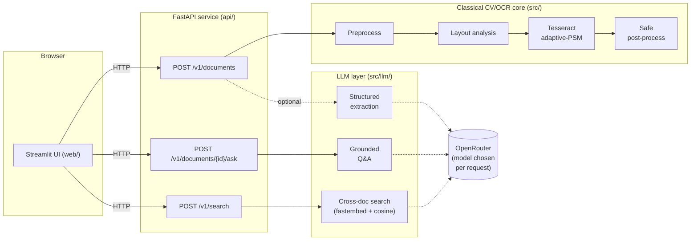

# Document OCR + AI Pipeline

[](https://github.com/JeganT143/Automated-Document-Analysis-and-OCR-System-for-Multi-Format-Documents/actions/workflows/ci.yml)
[](LICENSE)


A document-intelligence service that turns an invoice/receipt image into
clean structured data: a **classical computer-vision + Tesseract OCR
pipeline** for the actual text recognition, with an **LLM structured-
extraction, grounded Q&A and cross-document RAG layer** on top (via
OpenRouter, model chosen per-request), behind a **FastAPI backend** with a
**Streamlit** front end. Containerized, tested, evaluated with real numbers,
deployed on Google Cloud Run.

**Live demo:** see [`docs/DEPLOYMENT.md`](docs/DEPLOYMENT.md) for the deploy
guide — the running instance's URL goes here once deployed.

```
image ──▶ preprocess ──▶ layout analysis ──▶ recognise ──▶ post-process ──▶ structured output
        (classical CV)     (classical CV)    (Tesseract,      │
                                             adaptive PSM)      ▼
                                                          LLM extraction ──▶ OpenRouter
                                                          grounded Q&A   ──▶ (model chosen
                                                          cross-doc RAG ──▶  per-request)
```

*Originally built for EE7204/EC7205 (Image Processing & Computer Vision,
Univ. of Ruhuna) as a pure classical-CV OCR pipeline; the sections below
marked **LLM layer** / **API** / **deployment** are a later pass that turned
it into a full-stack, evaluated, deployed service.*

## Screenshots

| | |
|---|---|
|  |  |
| Landing page — model picker, layout/extraction toggles, cross-document search | LLM structured extraction, live against OpenRouter (model badge shows which one ran) |
|  |  |
| Stage-by-stage pipeline walkthrough with recognition stats | Grounded Q&A — answer generated from the document's own OCR text |

---

## Why classical CV *and* an LLM, not just an LLM

A multimodal LLM could read these invoices directly. This project
deliberately keeps the classical pipeline as the recognition engine and adds
the LLM as a *structuring* layer on top, because:

- **It's cheaper and faster at scale.** Tesseract on a CPU is ~2.5s/doc and
  free; routing every page through a vision-LLM call is slower and costs
  real money per document (see the [model comparison](#llm-model-comparison)
  below for actual measured cost/latency numbers).
- **It's independently measurable.** OCR accuracy (CER/WER) and extraction
  accuracy are different failure modes with different fixes — collapsing
  them into one LLM call makes it much harder to tell *why* a document
  failed. Keeping them separate is what makes the evaluation harness in
  §[Evaluation](#evaluation-real-numbers) possible at all.
- **It degrades safely.** If `OPENROUTER_API_KEY` isn't set, or the LLM call
  fails, extraction falls back to a regex extractor and the app keeps
  working — there's no code path where a missing/failed LLM call breaks OCR.

The LLM's job is what LLMs are actually good at: turning noisy free text
into a validated schema, answering questions in natural language, and
semantic search — not glorified pixel-reading.

## Architecture



Two independently deployable services (`api/`, `web/`) — see
[Service split](#service-split) for why.

## What's inside

| Area | Where | What |
|---|---|---|
| Classical CV/OCR core | `src/pipeline.py`, `src/layout_analysis.py`, `src/postprocessing.py` | Preprocessing, connected-component layout analysis, adaptive-PSM Tesseract, safe (non-destructive) text cleanup |
| LLM / RAG layer | `src/llm/` | OpenRouter client, structured extraction w/ schema validation + repair retry + regex fallback, grounded Q&A, session-scoped semantic search |
| API | `api/` | FastAPI backend — REST endpoints, Pydantic schemas, structured JSON logging, CORS, OpenAPI docs at `/docs` |
| Web UI | `web/` | Streamlit front end — a pure HTTP client of the API (no OpenCV/Tesseract/OpenAI in this process) |
| Evaluation | `scripts/evaluate.py`, `scripts/evaluate_llm.py` | CER/WER/token-F1 on a labelled synthetic dataset; a real cost/latency/accuracy comparison across OpenRouter models |
| Tests | `tests/` | pytest, all LLM/network calls mocked — runs with zero API key, zero cost, in CI |
| Containers | `Dockerfile.api`, `Dockerfile.web`, `docker-compose.yml` | Multi-stage builds, non-root users, lean web image |
| CI/CD | `.github/workflows/` | Lint + test + docker-build on every push; keyless (Workload Identity Federation) deploy to Cloud Run on `main` |

---

## The classical CV/OCR pipeline

| Stage | Module | What it does |
|-------|--------|--------------|
| 1. Preprocess | `OCRPreprocessor` in `src/pipeline.py` | auto-invert dark pages · illumination flattening · projection-profile deskew · **resolution normalisation** (up-scale small text) · light denoise. Keeps a clean **grayscale** image — no destructive binarisation. |
| 2. Layout analysis | `src/layout_analysis.py` | connected components · fast morphological region smearing · region classification (text / table / image / header-footer). |
| 3. Recognise | `DocumentOCRPipeline` in `src/pipeline.py` | Tesseract LSTM with **adaptive page segmentation** (tries PSM 4/6/3, keeps the most confident) and a CLAHE retry for hard scans. |
| 4. Post-process | `src/postprocessing.py` | **safe** clean-up (de-hyphenation, spacing, currency) that never rewrites words · regex invoice-field extraction (the fallback path when no LLM is configured) · JSON / TXT / CSV. |

### Why accuracy was low before — and what fixed it

A measured root-cause analysis (`scripts/evaluate.py --baseline`) found:

1. **No text at all.** Without Tesseract installed, the old default emitted
   `[word]` placeholders → **0%** of the text recovered (CER ≈ 90%).
2. **Preprocessing hurt OCR.** Bilateral + Otsu + morphology was *worse*
   than raw grayscale — Tesseract has its own, better binariser.
3. **Post-processing corrupted text.** A ~100-word spell-corrector mapped
   valid words to nonsense (`Kandy → And`). It's now removed; clean-up is
   safe-only (see the module docstring in `src/postprocessing.py`).

The pipeline keeps only the preprocessing that *measurably helps* OCR, adds
resolution normalisation + adaptive PSM, and structures the output.

## The LLM / RAG layer

- **Structured extraction** (`src/llm/extract.py`) — OCR text → a
  Pydantic-validated JSON schema (vendor, invoice number, date, line items,
  subtotal, tax, total, currency) via an OpenRouter chat completion in JSON
  mode. One repair retry on invalid JSON (the validation error is fed back
  to the model). Falls back to the regex extractor — never raises — if no
  key is configured or the LLM call fails.
- **Grounded Q&A** (`src/llm/qa.py`) — ask a question about the current
  document; the model is instructed to answer only from the OCR'd text and
  say so when it can't, rather than invent an answer.
- **Cross-document search** (`src/llm/search.py`) — as documents are
  processed in a session, they're embedded locally with
  [`fastembed`](https://github.com/qdrant/fastembed) (ONNX, CPU-only, no
  torch) and held in an in-memory, **session-partitioned** store; a search
  query retrieves the most relevant documents by cosine similarity and gets
  a grounded, cited answer. Deliberately **session-scoped, not persistent**
  — see [Limitations](#limitations--future-work).
- **Model choice is per-request**, from a small curated cross-provider
  allow-list (`src/llm/client.AVAILABLE_MODELS`) — the UI's model dropdown
  picks a model *id*; the OpenRouter API key itself never leaves the server.

## Evaluation (real numbers)

Labelled synthetic invoices (real TrueType fonts, scan-like noise + skew —
exact ground truth, regenerate with `scripts/make_invoice_dataset.py`),
scored with `scripts/evaluate.py --baseline --report RESULTS.md`. Full,
regenerated report: [`RESULTS.md`](RESULTS.md).

| Configuration | CER ↓ | Char acc. | WER ↓ | Token-F1 ↑ |
|---|--:|--:|--:|--:|
| Raw Tesseract (`--psm 6`) | 6.43% | 93.57% | 13.86% | 92.14% |
| **This pipeline** | **0.34%** | **99.66%** | **2.51%** | **98.16%** |

### LLM model comparison

`scripts/evaluate_llm.py` runs field-level extraction accuracy, latency and
an estimated cost across several OpenRouter models on the same labelled
set — a quantitative answer to "which model should this app default to?"
instead of a vibe. Requires `OPENROUTER_API_KEY`; run it yourself and the
results append to `RESULTS.md`:

```bash
OPENROUTER_API_KEY=... python scripts/evaluate_llm.py --report RESULTS.md
```

## API

Interactive docs (Swagger UI) are served by the running api service at
`/docs`. Summary:

| Endpoint | What |
|---|---|
| `POST /v1/documents` | Upload an image → OCR + layout trace + optional LLM extraction. Returns every pipeline stage as a rendered image plus structured fields/text. |
| `POST /v1/documents/{id}/ask` | Grounded Q&A over a previously processed document. |
| `POST /v1/search` | Cross-document semantic search + grounded answer, scoped to the caller's session (`X-Session-Id` header). |
| `GET /v1/models` | The curated OpenRouter model list for the UI dropdown. |
| `GET /v1/sample-document` | Generates a synthetic invoice server-side, so the demo works without a real document handy. |
| `GET /healthz` | Health check (Cloud Run readiness). |

### Service split

`api/` and `web/` are two separately deployable services rather than one
monolith: the API is the real product surface (documented, tested,
independently curl-able), and the Streamlit UI is a thin, dependency-light
client of it — swapping in a different frontend later doesn't touch the
pipeline or LLM code at all. It also keeps the `web/` image small (~150-200MB,
no OpenCV/Tesseract/OpenAI/fastembed) versus the `api/` image (~1GB, all the
CV/LLM dependencies).

---

## Quick start

### Docker Compose (recommended — matches production)

```bash
cp .env.example .env   # optionally fill in OPENROUTER_API_KEY
docker compose up --build
# api:  http://localhost:8010  (docs at /docs)
# web:  http://localhost:8501
```

Works with **no** `OPENROUTER_API_KEY` set — LLM extraction falls back to
the regex extractor, and Q&A/search return a clear "not configured" message
instead of failing.

### Local (no Docker)

```bash
python3 -m venv env && source env/bin/activate
pip install -r requirements-dev.txt          # api + web + test deps

# Tesseract engine (pick one)
sudo apt install tesseract-ocr               # normal machines
bash scripts/install_tesseract_local.sh      # no root: unpacks to ~/.local/opt/tesseract

# terminal 1
uvicorn api.main:app --reload
# terminal 2
API_BASE_URL=http://localhost:8000 streamlit run web/app.py

# or just the OCR pipeline, no API/UI:
python src/main.py path/to/invoice.png --format txt
```

## Testing & CI

```bash
ruff check .
pytest -q --cov=src --cov=api
```

Every LLM/network call in the test suite is mocked (`tests/test_llm_*.py`,
`tests/test_api_*.py`) — the suite runs with **zero** API key and **zero**
cost, which is what makes it safe to run unattended in CI on every push (see
`.github/workflows/ci.yml`).

## Deployment

Deployed to **Google Cloud Run** (two services, scale-to-zero, free tier at
this traffic level) with a custom subdomain and keyless CI/CD via Workload
Identity Federation. Full step-by-step guide, including exact `gcloud`
commands: **[`docs/DEPLOYMENT.md`](docs/DEPLOYMENT.md)**.

## Project structure

```
├── src/                  # classical CV/OCR core + the LLM/RAG layer
│   ├── pipeline.py       # preprocessing + adaptive-PSM Tesseract OCR
│   ├── layout_analysis.py
│   ├── postprocessing.py # safe cleanup + regex field extraction (fallback)
│   ├── evaluation.py     # CER/WER/token-F1 metrics
│   └── llm/              # OpenRouter client, extraction, Q&A, search
├── api/                  # FastAPI backend
│   └── routers/          # documents, search, models, samples
├── web/                  # Streamlit UI (HTTP client of api/)
├── scripts/                # dataset generation + evaluation harnesses
├── tests/                   # pytest, all external calls mocked
├── docs/DEPLOYMENT.md        # Cloud Run deployment guide
├── Dockerfile.api, Dockerfile.web, docker-compose.yml
└── .github/workflows/          # CI (lint+test+build) and CD (deploy)
```

## Limitations & future work

Documented honestly rather than hidden:

- **Cross-document search is session-scoped, not persistent.** The document
  store lives in-memory in a single Cloud Run instance; a cold start or
  instance recycle clears it. `--session-affinity` makes a given browser
  session *likely* to land on the same instance, not guaranteed. At real
  scale this would move to pgvector/Qdrant keyed by an authenticated user
  id — deliberately out of scope for a portfolio demo.
- **English print only.** Tesseract's `eng` model; the pipeline wasn't built
  or tuned for handwriting or non-Latin scripts.
- **Cold starts.** Both Cloud Run services scale to zero; the first request
  after idle time is slower (a few seconds), especially if it also triggers
  the `fastembed` model's first load. Acceptable for a demo; a production
  SLA would need `min-instances ≥ 1` (and the cost that comes with it).
- **LLM extraction cost figures in `RESULTS.md` are estimates** (a
  chars/4 token heuristic × published per-model pricing), not billed
  amounts — good enough for relative model comparison, not for a real
  billing forecast.

## License

[MIT](LICENSE)
